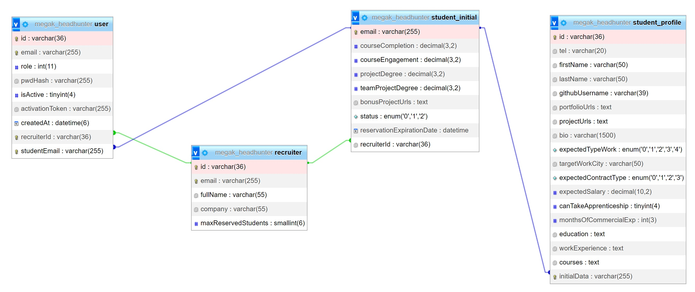

### All endpoint addresses mentioned below start with the host address. For development work, it is: 'http://localhost:3001'. In the code, this should be saved in a variable so that it can be easily changed during the releasing process on a server.

### Table of contents:

1. [Students import](#1-students-import)
2. [Adding recruiter](#2-adding-recruiter)
3. [Logging in](#3-logging-in)
4. [Logging out](#4-logging-out)
5. [JWT token](#5-jwt-token)
6. [Activation e-mail](#6-activation-e-mail)
7. [Password changing](#7-password-changing)
8. [Password reset](#8-password-reset)
9. [Student module (profile and initial data)](#9-student-module-profile-and-initial-data)
   - [Getting all students profiles](#getting-all-students-profiles)
   - [Getting one student profile](#getting-one-student-profile)
   - [Creating new student profile](#creating-new-student-profile)
   - [Updating student profile](#updating-student-profile)
   - [List of initial data of students](#list-of-initial-data-of-students-and-with-profile-data-if-student-have-done-activation-and-filled-up-profile-data)
   - [Initial data of one student](#initial-data-of-one-student-and-with-profile-data-if-student-have-done-activation-and-filled-up-profile-data)
10. [HR module](#10-hr-module)
11. [Filtering, sorting and pagination of available students](#11-filtering-sorting-and-pagination-of-available-students)
12. [Getting yourself (your user data)](#12-getting-yourself-your-user-data)
13. [Student reservation](#13-student-reservation)
14. [Marking by the student that he or she has been hired](#14-marking-by-the-student-that-he-or-she-has-been-hired)
15. [Hiring student by recruiter](#15-hiring-student-by-recruiter)
16. [Restoring the "available" status to the student (in case of cancellation of the reservation)](#16-restoring-the-available-status-to-the-student-in-case-of-cancellation-of-the-reservation)
17. [Adding admin](#17-adding-admin)
18. [View of the tables in the database and the relationships between them](#18-view-of-the-tables-in-the-database-and-the-relationships-between-them)

## 1. Students import

- address: `/import/students` method: POST
- NOTE: To test this module you need any data in your database. 
First you need to have [mailslurper](https://github.com/mailslurper/mailslurper/releases/tag/1.14.1). After downloading, just run mailslurper.exe and open in your browser this address: http://localhost:8080 make sure that port 8085 is free. 
You need a .csv file with data matching the interface: `StudentInitialInterface[]`,  so an array of objects: 
  `StudentInitialInterface` { 
  email: string; 
  courseCompletion: number; 
  courseEngagement: number; 
  projectDegree: number; 
  teamProjectDegree: number; 
  bonusProjectUrls: string[]; 
  profile?: StudentProfileInterface; `<< THIS OF COURSE YOU DO NOT NEED TO ADD DURING CREATING, it will be assigned automatically when student profile will be created` 
  } 
  Example content of .csv file:
  >email;courseCompletion;courseEngagement;projectDegree;teamProjectDegree;bonusProjectUrls
asd@asdghjghjghj.com;4;4;3;5;https://github.com/ligrys-dev/megak-v3-headhunter-be-gr2, https://github.com/ligrys-dev/megak-v3-headhunter-fe-gr2
ok@okrj6jfghjghj.com;2;2;2;2;www.cos.com,www.asd.com,www.aha.it
ssd@example.io;3;3;5;5;urlexample.asd,wp.pl,https://megak.pl
aaa@test.pl;3.5;2;5;1;https://megak.pl   

  You can just copy this to any text editor and save as .csv file keeping the "enters" appropriately.  
- Activation emails with temporary password are sent.  
  (you can check it with mailsluprer when you open http://localhost:8080 in your browser)
- no validation errors are thrown, only json is returned in response:  
  {type `FailedEmails`, type `SuccesfulEmails`}

## 2. Adding recruiter:

- address: `/user/recruiter` method: POST
- body: `RecruiterInterface`{  
  id: string; 
  email: string; 
  fullName: string; 
  company: string; 
  maxReservedStudents: number; 
  }
- in case of validation error, a Bad Request exception is returned: 
  { 
  "message": <`An string array with validation errors`>, 
  "error": "Bad Request", 
  "statusCode": 400 
  } 
- res — json: {type `FailedEmails` (it will be empty), type `SuccesfulEmails` (an array with one element)}

## 3. Logging in:

- address: `/login` method: POST
- body: {email: string, password: string}
- a JWT token is added to the httpOnly cookie, which stores data - interface UserFromReq
- public available
- if the login data is incorrect, a Forbidden Exception is returned
- res - json: {id: string} if login data is correct

## 4. Logging out:

- address: `/logout` method: POST
- the cookie with the token is cleared
- res - json: {ok: true}

## 5. JWT Token:

- stores information about the user's ID and his role
- based on the token, the user is identified in the application
- you can get the data - interface UserFromReq - z req.user

## 6. Activation e-mail:

- after adding a student/recruiter, an activation e-mail is sent
- address: `/user/activate/id/activationToken` method: GET
- during activation, `isActive` is set to `true` and `activationToken` to `null`

## 7. Password changing:

- address: `/user/change-pass` method: PATCH
- body: {oldPwd: string; newPwd: string}
- checks whether the old password is correct and if so, changes pwdHash in the database
- res - json: {ok: true}

## 8. Password reset:

- address: `/user/reset-pass` method: PATCH
- body: {email: string}
- the method searches for a user with the given email address and if it finds it, it changes the password to a new, automatically generated one and sends an email with this password, and if not, it throws a Forbidden Exception
- res - json: {ok: true}

## 9. Student module (profile and initial data)

### Getting all students profiles:

- address: `/student` method: GET,
- returns students data in an array of objects matching the interface : 
  `StudentProfileInterface` { 
  id: string; 
  initialData: `StudentInitialInterface`; 
  tel: string | null; 
  firstName: string; 
  lastName: string; 
  githubUsername: string; 
  portfolioUrls: string[] | null; 
  projectUrls: string[]; 
  bio: string; 
  expectedTypeWork: TypeWork; 
  targetWorkCity: string; 
  expectedContractType: ContractType; 
  expectedSalary: number | null; 
  canTakeApprenticeship: boolean; 
  monthsOfCommercialExp: number; 
  education: string | null; 
  workExperience: string | null; 
  courses: string | null; 
  }

### Getting one student profile

- address: `/student/:id` method: GET,
- returns one object matching the interface `StudentProfileInterface` (look up)

### Creating new student profile

- address: `/student` method: POST,
- takes in body an object `StudentProfileInterface`,
- it adds new student profile,
- returns this new object.

### Updating student profile

- address: `/student/:id` method: PATCH,
- takes in body an object `StudentProfileInterface`,
- it updates the student's profile,
- returns updated object.

### List of initial data of students (and with profile data if student have done activation and filled up profile data)

- address: `/student/initial` method: GET,
- returns an array of objects with initial data of students: 
  `StudentInitialInterface` { 
  email: string; 
  courseCompletion: number; 
  courseEngagement: number; 
  projectDegree: number; 
  teamProjectDegree: number; 
  bonusProjectUrls: string[]; 
  }

### Initial data of one student (and with profile data if student have done activation and filled up profile data)

- address: `/student/initial/:email` method: GET,
- returns one object `StudentInitialInterface` (look up)

## 10. HR module

- address: `/hr` method: GET
- address: `/hr/:id` method: GET

## 11. Filtering, sorting and pagination of available students

- address: `student/list/:status/:page/:take?orderBy=&filters=` method: GET
- `status` is optional — it default value is `0`
- `status`: `0` - available students (default), `1` - reserved for conversation, `2` - hired
- parameters `page` i `take` are optional. Default value for `page` is `1` and for `take` is `10`
- parameters `query` are also optional, if there is nothing, the list will not be filtered or sorted
- If we want to change some parameter, we need to pass all the previous ones, for example: if we want to change only the `page` number, we must also provide the `status`
- recruiter's ID is taken from logged user, so it is not necessary to provide it
- query `orderBy` - responsible for sorting — takes value from enum `StudentOrderByOptions`
- query `filters` - responsible for filtering — takes object `filters`, which implements interface `StudentFilters`, every field is optional
- `filters` in url must be transformed to string and to an url component: `const encoded = (encodeURIComponent(JSON.stringify(filters))`
- json is returned: `{students(an array with students data), studentsCount(amount of students), numberOfPages(number of pages)}`
- example endpoint: `http://localhost:3001/student/list/0/2/5?orderBy=profile.expectedSalary&filters=%7B%22courseCompletion%22%3A2%2C%22projectDegree%22%3A5%2C%22profile.expectedContractType%22%3A0%2C%22githubUsername%22%3A%22foobar%22%7D`

## 12. Getting yourself (your user data)

- address: `/user` method: GET
- getting own entity with user ID from request
- returns json with id, email, role and entity of student (with profile) or hr — depending on the role.

## 13. Student reservation

- address: `/hr/reserve/:email` method: PATCH
- parametr email — email studenta, którego chcemy zarezerwować
- zmienia status studenta na do rozmowy
- przypisuje studenta do rekrutera
- dodaje datę wygaśnięcia rezerwacji na za 10 dni

## 14. Marking by the student that he or she has been hired

- address: `/student/hired` method: PATCH
- metoda dozwolona dla kursanta
- zmienia status studenta na zatrudniony
- student jest pobierany z zalogowanego usera, nie trzeba nigdzie przekazywać id ani emaila

## 15. Hiring student by recruiter

- address: `/hr/hire/:email` method: PATCH
- parametr email — email studenta, którego chcemy zatrudnić
- zmienia status studenta na zatrudniony

## 16. Restoring the "available" status to the student (in case of cancellation of the reservation)

- address: `/hr/available/:email` method: PATCH
- metoda dozwolona dla rekrutera
- zmienia status studenta na available
- student jest pobierany na podstawie jego id z danych profilowych

## 17. Adding admin

- address: `/user/admin` method: POST
- body: {email: string, password: string}
- dodać nagłówek: x-password, który zawiera hasło potrzebne do stworzenia admina (w .env)
- trzeba to zrobić w insomni/postmanie itp

## 18. View of the tables in the database and the relationships between them:

